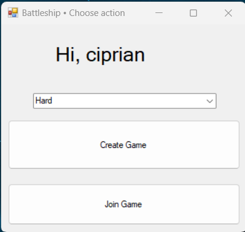
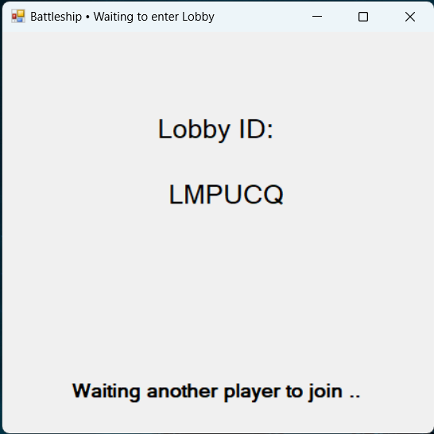
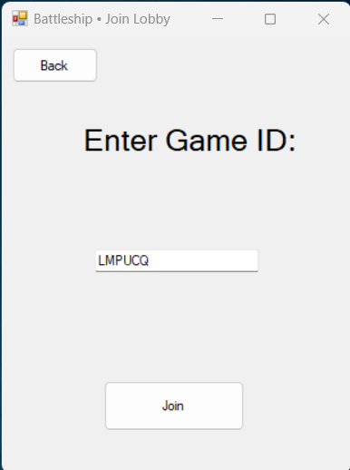
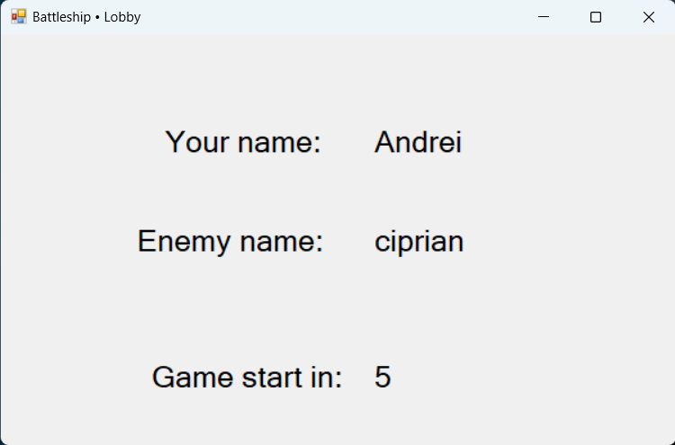
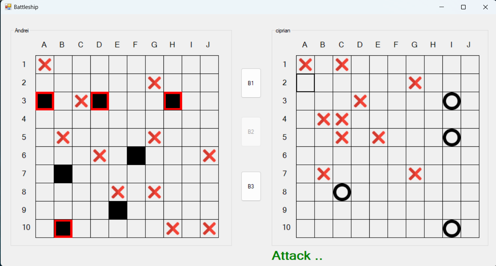

# Battleship Game with C#

## Features

- Real-time multiplayer functionality via Socket.io for seamless gameplay with opponents.
- Private games with lobbies for secure multiplayer matches.

## Requirements

- C# (.NET framework or .NET Core)

## Installation

1. Clone this repository:

```bash
git clone https://github.com/ciprian-trandafir/battleship-game.git
```
2. Open the project in Visual Studio.
3. Configure backend API URL and port in **Main.cs** file.
4. Run the application.

## Screenshots






